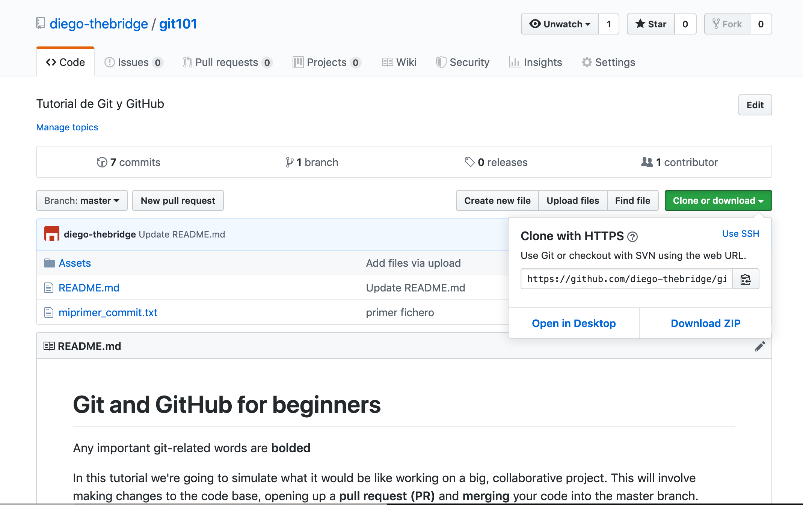

# Git and GitHub for beginners


Any important git-related words are **bolded**

In this tutorial we're going to simulate what it would be like working on a big, collaborative project. This will involve making changes to the code base, opening up a **pull request (PR)** and **merging** your code into the master branch.

# Step 0: Send me your GitHub username

**To push code changes to a GitHub repository, you must be listed as a collaborator on that repository. Please email me your GitHub username at diego@thebridge.tech so I can add you as a collaborator to the gittutorial repository.**

# Step 1:  Cloning from a remote server to your local machine

The process of downloading a **repo** from a remote server to your local machine is known as **cloning**.

To clone a repo, first you need to copy the repo's URL as seen below.



Move to where you want to place the project on your local machine using the ```cd``` (change directory) command. For instance if you have a 'projects' folder on your desktop, you'd do something like
```cd ~/Desktop/projects```

When you clone a repo, it downloads a brand new folder which contains all the files inside of it (so you don't need to make a specific folder for the project)

Once you're in the location you want to be, in the terminal, use the command:

```git clone https://github.com/diego-thebridge/git101```
